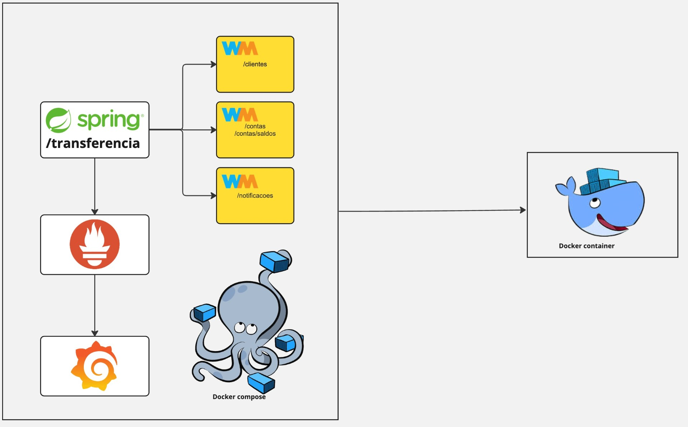

## Arquitetura da API

  

# Deploy

Deploy utilizando Docker e Docker Compose.

## Passo 1: Preparação do Ambiente

Clone o repositório do projeto para sua máquina local usando o Git:

```bash
git clone https://github.com/lucasnst/desafio-itau.git
cd desafio-itau
```

## Passo 2: Construção dos Containers com Docker Compose

Na raiz do projeto, onde o arquivo docker-compose.yml está localizado, execute o comando abaixo para construir e iniciar todos o container do Wiremock definido no Docker Compose:

```bash
docker-compose up --build -d
```

## GET Mock Client

  http://localhost:9191/clientes/bcdd1048-a501-4608-bc82-66d7b4db3600
  
  http://localhost:9191/clientes/2ceb26e9-7b5c-417e-bf75-ffaa66e3a76f

  + Response 200 (application/json)

    + Body

            {
                "id": "bcdd1048-a501-4608-bc82-66d7b4db3600",
                "nome": "João Silva",
                "telefone": "912348765",
                "tipoPessoa": "Fisica"
            }
  


## GET Mock Contas

  http://localhost:9191/contas/d0d32142-74b7-4aca-9c68-838aeacef96b
  
  http://localhost:9191/contas/41313d7b-bd75-4c75-9dea-1f4be434007f

  + Response 200 (application/json)

    + Body

            {
                "id": "d0d32142-74b7-4aca-9c68-838aeacef96b,
                "saldo": 5000.00
                "ativo": true
                "limiteDiario": 500.00
            }


      

## PUT Mock Contas - Atualiza Saldo

  http://localhost:9191/contas/saldos

  + Request (application/json)

    + Body

            {
              "valor": 1000.00,
              "conta": {
                  "idOrigem": "d0d32142-74b7-4aca-9c68-838aeacef96b",
                  "idDestino": "41313d7b-bd75-4c75-9dea-1f4be434007f"
              }
            }

  + Response 204 - No content (application/json)


## POST Mock Bacen

  http://localhost:9191/notificacoes

  + Request (application/json)

    + Body

            {
              "valor": 1000.00,
              "conta": {
                  "idOrigem": "d0d32142-74b7-4aca-9c68-838aeacef96b",
                  "idDestino": "41313d7b-bd75-4c75-9dea-1f4be434007f"
              }
            }

  + Response 204 - No Content (application/json)
      


## POST API Transferência

http://localhost:8080/transferencia

  + Request (application/json)

    + Body

            {
              "idCliente": "2ceb26e9-7b5c-417e-bf75-ffaa66e3a76f",
              "valor": 1000.00,
              "conta": {
                  "idOrigem": "d0d32142-74b7-4aca-9c68-838aeacef96b",
                  "idDestino": "41313d7b-bd75-4c75-9dea-1f4be434007f"
              }
            }

  + Response 200 (application/json)

    + Body

            {
                "id_transferencia": "410bb5b0-429f-46b1-8621-b7da101b1e28"
            }


  ## Monitoramento (Grafana)

  http://localhost:3000/
  
  ```bash
login: admin
senha: admin
(Não é necessario trocar a senha - Clicar em Skip)
```
  


 ```bash
No menu lateral vá até a aba "Data sources"
```


 ```bash
Adicione um novo Data source, no nosso caso o Prometheus
```


 ```bash
Na barra de pesquisa procure por "Import Dashboards"
```


 ```bash
A comunidade oferece diversos dashboards para o grafana, mas recomendamos o 14430 (próprio para spring boot), clique em LOAD e novamente no LOAD abaixo
```


 ```bash
Note que nosso dashboard ainda não tem nenhum dado, portando vamos clicar em "Dashboards settings" (como destaado na imagem) para configura-lo
```


 ```bash
Vá até a aba "Variables"
```


 ```bash
Iremos alterar as variaveis "instance" e "application"
```


 ```bash
Deixa a varivel "instance" com a aba "Label filters" como no destaque em vermelho
```


 ```bash
Deixa a varivel "application" com a aba "Label" como no destaque em vermelho e apague a aba "metrics" e "Label filters" como no destaque em azul
```


 ```bash
Volte até a aba do seu Dashboard e ele está pronto para uso
```


## Autores

- [@lucasnst](https://github.com/lucasnst)